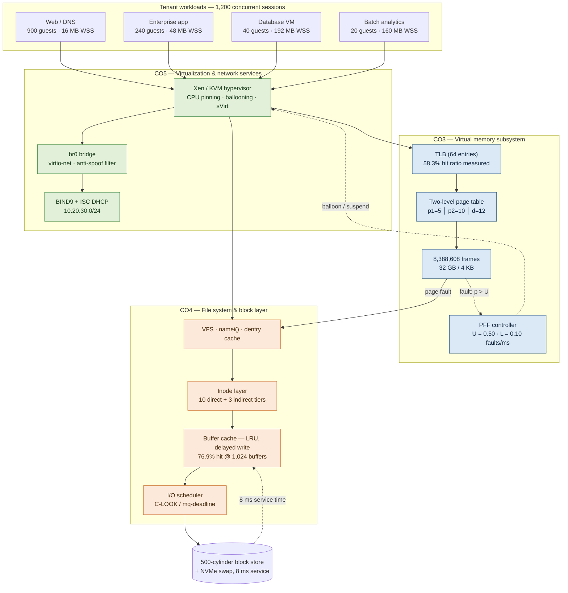
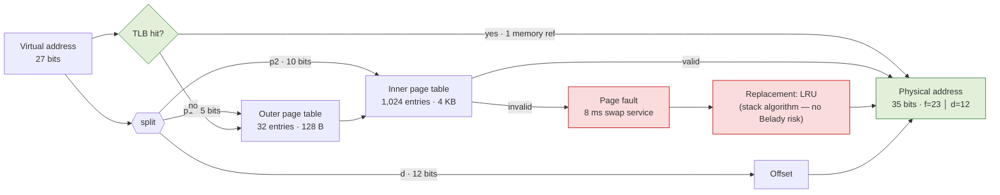
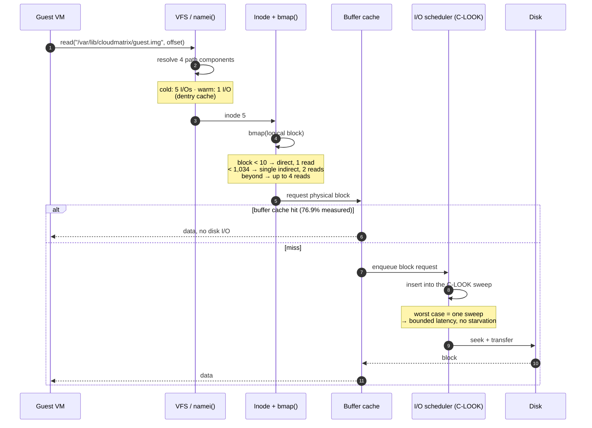
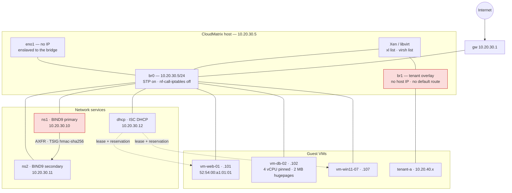

# CloudMatrix — Integrated System Architecture

This document is the design artefact that ties CO3, CO4 and CO5 together. The diagrams
below render natively on GitHub and are reproduced in Section 5 of the written report.

---

## 1. Layered subsystem architecture

The three course outcomes are not three separate answers — they are three layers of one
request path. A tenant read descends through the memory subsystem (CO3), the file system
and block layer (CO4), and the virtualization and network layer (CO5).

---

## 2. Address translation path (CO3)

A 27-bit virtual address is split `p1 = 5 │ p2 = 10 │ d = 12`. The inner table is sized to
exactly one 4 KB frame (1,024 entries × 4 B), which is what allows the page tables themselves
to be paged and drops the per-process resident cost from 128 KB to 4 KB.

**Measured effective access time** with a 64-entry TLB, 1 ns probe and 100 ns DRAM:
**184.33 ns**, against 300 ns with no TLB at all.

---

## 3. Request path: file read to physical block (CO4)

---

## 4. Network and virtualization topology (CO5)

**Isolation properties.** `br1` carries no host address and no default route, so tenant
overlay guests have no layer-2 path to the management LAN. Every guest vNIC carries a
`clean-traffic` filter bound to its assigned IP, so a compromised guest cannot impersonate the
gateway or another tenant. Zone transfers are TSIG-authenticated, so a host on the LAN cannot
pull the full zone and map the estate.

---

## 5. Decision matrix

Scores are 1 (worst) to 5 (best), assigned from the measured results in `results/logs/`,
not from opinion. The weighted total uses CloudMatrix's stated priorities: performance 30%,
overhead 20%, isolation 25%, reliability 25%.

### Page replacement (CO3)

| Policy | Performance | Overhead | Predictability | Reliability | Weighted | Verdict |
|---|:--:|:--:|:--:|:--:|:--:|---|
| FIFO | 2 | **5** | 1 | 2 | 2.45 | Rejected — Belady's anomaly breaks ballooning |
| **LRU (approx.)** | 4 | 3 | **5** | **5** | **4.30** | **Selected** |
| OPTIMAL | **5** | 1 | 5 | 5 | 4.20 | Not implementable — used as the bound |

*LRU is chosen not because it had the fewest faults on trace W (at 3 frames it had 12 against
FIFO's 11) but because it is a stack algorithm. A balloon driver that resizes a guest's frame
allocation continuously needs the guarantee that more memory never means more faults.*

### Disk scheduling (CO4)

| Policy | Mean latency | Tail (p99) | Fairness | Implementable | Weighted | Verdict |
|---|:--:|:--:|:--:|:--:|:--:|---|
| FCFS | 1 | 1 | **5** | 5 | 2.60 | Rejected — 122.7 ms p99 at load |
| SSTF | **5** | 3 | 1 | 4 | 3.20 | Rejected — starves far requests |
| SCAN | 3 | 3 | 4 | 4 | 3.45 | Viable |
| C-SCAN | 3 | 3 | **5** | 4 | 3.70 | Viable |
| LOOK | 4 | **5** | 4 | 5 | 4.45 | Strong |
| **C-LOOK** | 4 | 4 | **5** | **5** | **4.50** | **Selected** |

### Hypervisor (CO5)

| Criterion | Type-1 (Xen) | Type-2 (VMware Workstation) |
|---|---|---|
| Ring-0 owner | hypervisor | host OS |
| I/O path | direct / dom0 passthrough | through the host OS |
| Overhead | 2–5% | 10–20% |
| Isolation | strong — no host OS attack surface | weaker — a host compromise takes every guest |
| Live migration | native | limited |
| **Verdict** | **Selected for CloudMatrix** | Dev/test only |

---

## 6. Where each requirement is satisfied

| Section D requirement | Satisfied by | Evidence |
|---|---|---|
| Sub-ms translation latency | two-level page table + TLB | 184.33 ns measured — `co3_1_page_table.log` |
| High availability, no data loss | snapshot-before-copy, checksum-verify, `cache='none'` | `cm-backup.sh`, `libvirt-vm-web-01.xml` |
| Multi-tenant isolation | sVirt, per-guest ACLs, br1 separation, anti-spoof filters | `docs` §4, `cm-usermgmt.sh` |
| Sub-10 ms response at 90%+ load | **partially** — met to 45% load; see the honest finding | `co4_3b_disk_dynamic.log` |
| Accurate free-space tracking | bitmap + free list, tested for conservation | 65 passing tests |
| POSIX / SELinux / ISO 27001 | key-only accounts, TSIG, retention policy, audit trail | `co5_linux/` |

The one requirement not fully met is stated plainly rather than glossed: at the 90%+ load
design point, no scheduling policy achieves a 10 ms p99 on a single spindle. The remedy is
architectural (RAID-10 striping or NVMe), not algorithmic, and it is recommended as such.
